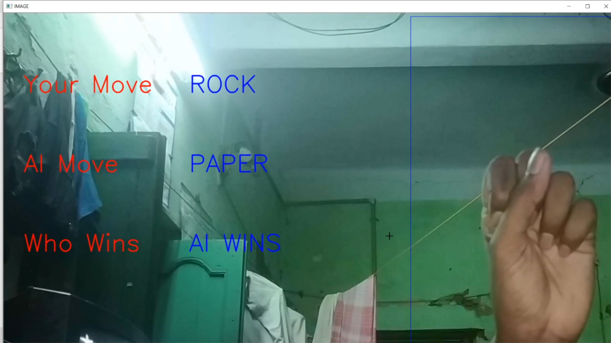

# Rock-Paper-Sissors-Game-With-AI
Play Rock Paper Sissors With Ai.It is a Image Classification Model That Use Keras

I am started learning machine learning and this is my one of the fitsr Image Classification project.

## What Libraries I Used
1.Numpy
2.Keras
3.OpenCV
4.sys and Os

## What It DO?
->It takes input from live video using webcam and detect is it rock,papaer or sissors by checking each frame

->The it tells the move if it is "ROCK then ai move will be "PAPER",if user move is "PAPER" then ai move will be"SISSORS" so on and so forth

## How It Works?
->as the core feature of this machine learning model is to detect three types of images "ROCK","PAPER" and "SISSORS" so it has three classes name as follows

->we have to datasets named train and test.train set contains most of the images of each classes(approx 300 per class) an test set contanins around 65 images in each class

->then we train the Keras Sequential model on this test set with three input layers

->after training(50 epochs) the model generates a .json file and our trained model(.h5) to use it further

->then using OpenCV library we check whether user moves is "ROCK","PAPAER",or "SISSORS" and the ai moves depends on it

## Some Downside this project
-> as i use my phone camera the traing image quality is not so good so the prediction is on the productuion level

-> i only have my hands images to train so it maybe dont work on others hands(maybe) but i will try to add more training images

-> i dont use sufficiant training set to trin the model so it is not close to predict every move :(

-> my lighting was so bad so some images fetures are trained completely results bad prediction

I will try to overcome all downsides in my next projects :)

## Future Thoughts On This Project
-> I am thinking to implement it in a mobile app using API(Flask)

-> where user will send his moves to the api and here the image will be prossed and the ai will predict the image and send its response back to the app

-> I need more dataset for different circumstances(Image quality,Image sizes etc)

I am nebie to Machine Leanring and this is my first projcet will do more projects in future :)

## Some Example Images :)

## User Move - > Rock || AI Move - > Paper So Ai Wins

## User Move - > Paper || AI Move - > Sissors So Ai Wins

## User Move - > Sissors || AI Move - > Rock So Ai Wins

